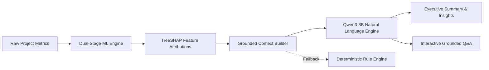

# 🔮 Nirmaan Dristi — AI Prediction Engine

> **Advanced Machine Learning & Explainable AI for Incremental Project Cost & Schedule Forecasting**  
> *Tailored for Central Sector Infrastructure Monitoring (PAIMANA Project-Month Dataset)*

---

## 📑 Table of Contents

- [Overview](#-overview)
- [Key Features](#-key-features)
- [Forecasting Methodology & Mathematical Formulation](#-forecasting-methodology--mathematical-formulation)
- [AI Natural Language & Explainability Layer](#-ai-natural-language--explainability-layer)
- [Architecture & Data Pipeline](#-architecture--data-pipeline)
- [Repository Structure](#-repository-structure)
- [Installation & Setup](#-installation--setup)
- [Quick Start & Execution Guide](#-quick-start--execution-guide)
  - [1. Model Training](#1-model-training)
  - [2. CLI Prediction Engine](#2-cli-prediction-engine)
  - [3. Interactive Streamlit Dashboard](#3-interactive-streamlit-dashboard)
- [Configuration & Environment Variables](#-configuration--environment-variables)
- [Validation & Evaluation Framework](#-validation--evaluation-framework)
- [Tech Stack](#-tech-stack)
- [License & Citation](#-license--citation)

---

## 🌟 Overview

**Nirmaan Drishti** is an end-to-end machine learning and explainable AI system designed to predict future risk, next-period cost overruns, and schedule delays for ongoing central sector infrastructure projects.

The ML architecture operates on a **Single Next-Period ($T+1$) Prediction Strategy**:
- Rather than forecasting distant 3-month or 6-month horizons with cumulative degradation, the system predicts whether a project will experience a schedule delay or budget overrun at the **next operational snapshot ($T+1$)** based strictly on conditions known at observation time $T$.
- Legacy 3-month and 6-month regression/classification pipelines have been cleanly retired.
- Continuous regression (predicting exact numerical $\Delta$ crore or $\Delta$ months) is **deferred for subsequent evaluation**; the current production system focuses on rigorous, calibrated classification and anomaly detection.

---

## 🚀 Key Features

- 🎯 **Next-Period ($T \to T+1$) Binary Targets**: Focuses on immediate, actionable next-month risk flags.
- 🛡️ **Zero Temporal Data Leakage**: Enforced by automated schema and temporal boundary assertions (`assert_zero_leakage`), ensuring features are strictly known at time $T$.
- ⚖️ **Imbalance-Calibrated Classifiers**: Employs cost-sensitive XGBoost with `scale_pos_weight` to handle severe class imbalance in cost overruns (15.8% base rate).
- 🔍 **Unsupervised Anomaly Detection**: Integrated Isolation Forest to detect irregular reporting trajectories and anomalous expenditure spikes.
- 🧠 **Explainable AI (TreeSHAP)**: Computes local and global feature attributions to highlight specific risk drivers and protective factors for each project.
- 🤖 **Qwen3-8B Natural Language Engine**: Translates complex ML and SHAP outputs into executive summaries and interactive project Q&A, backed by a deterministic rule-based fallback.

---

## 🧮 Forecasting Methodology & Mathematical Formulation

### 1. Next-Period ($T+1$) Target Derivation
For any project observation at report month $T$, outcomes are evaluated strictly at the immediate next valid chronological observation $T+1$ for the same project:

#### A. Classification Targets (Risk Radar)
- **$T+1$ Future Schedule Delay Target**:
  $$\text{future\_schedule\_delay}(T) = \begin{cases} 1 & \text{if } \text{schedule\_extension\_months}(T+1) \ge 1.0 \lor \text{slippage\_months}(T+1) \ge 1.0 \\ 0 & \text{otherwise} \end{cases}$$

- **$T+1$ Future Cost Overrun Target**:
  $$\text{future\_cost\_overrun}(T) = \begin{cases} 1 & \text{if } \text{cumulative\_expenditure\_cr}(T+1) > \text{original\_cost\_cr}(T) \\ 0 & \text{otherwise} \end{cases}$$

#### B. Continuous Regression Targets
- **Schedule Regression Formulations**:
  1. *Direct $T+1$ Delay*:
     $$Y_{\text{direct}}(T) = \text{schedule\_extension\_months}(T+1)$$
  2. *Delta Delay with Persistence Anchor*:
     $$Y_{\Delta}(T) = \text{schedule\_extension\_months}(T+1) - \text{schedule\_extension\_months}(T)$$
     $$\widehat{\text{Future Delay}} = \text{schedule\_extension\_months}(T) + \widehat{Y}_{\Delta}(T)$$
  *(Evaluated on validation: Direct $T+1$ Delay selected with Stacking Regressor achieving $R^2 = 0.8191$ on Val, $0.8700$ on Test).*

- **Unified Scale-Invariant Cost Multiplier Architecture**:
  To prevent contradictory independent cost models across project scales (₹1 Cr to ₹100,000+ Cr), the regressor predicts a scale-invariant multiplier:
  $$\text{Multiplier}(T+1) = \frac{\text{Anticipated Cost}(T+1)}{\text{Original Cost}(T)}$$
  All monetary and percentage targets are derived deterministically:
  $$\begin{aligned}
  \widehat{\text{Future Anticipated Cost (₹ Cr)}} &= \widehat{\text{Multiplier}} \times \text{Original Cost} \\
  \widehat{\text{Cost Escalation (₹ Cr)}} &= \max\left(0, \widehat{\text{Future Cost}} - \text{Original Cost}\right) \\
  \widehat{\text{Cost Overrun \%}} &= (\widehat{\text{Multiplier}} - 1.0) \times 100 \\
  \widehat{\Delta}\text{Cost Overrun \%} &= \max\left(0, \widehat{\text{Cost Overrun \%}} - \text{Current Cost Overrun \%}\right)
  \end{aligned}$$
  *(Winner: `HistGradientBoostingRegressor` achieving Holdout Test $R^2 = 0.9302$ on derived Future Cost, beating the historical benchmark of 0.8862).*

### 2. Transition Gap & Cohort Analysis
Transitions are defined strictly as the next chronological observation for the same project:
- **Total Usable Transitions**: 212,024 across 4,988 unique projects (terminal records dropped).
- **Exact 1-Month Transitions**: **207,079 (97.67%)**
- **Multi-Month Transitions**: **4,945 (2.33%)**
  - 2–3 Months: 3,945 (1.86%)
  - 4–6 Months: 618 (0.29%)
  - 7–12 Months: 279 (0.13%)
  - >12 Months: 103 (0.05%)
- **Temporal Splitting by Origin Date $T$**:
  - *Train ($T \le 2022\text{-}12\text{-}01$)*: 156,878 observations
  - *Validation ($2023\text{-}01\text{-}01 \le T \le 2024\text{-}06\text{-}01$)*: 27,890 observations
  - *Holdout Test ($2024\text{-}07\text{-}01 \le T \le 2026\text{-}04\text{-}01$)*: 27,256 observations

### 3. Completed Project Handling
Projects marked as completed have all future forecasts suppressed, presenting a certified historical summary rather than redundant predictive estimates.

---

## 🤖 AI Natural Language & Explainability Layer

Nirmaan Dristi integrates **Qwen3-8B** as an intelligent interpretation layer to provide human-readable narratives and conversational insight.



### Core Guardrails & Capabilities
- **Strict Factual Grounding**: The LLM operates solely as an explainer and translator. Numerical figures are strictly computed by the ML engine.
- **Structured Executive Summaries**: Automatically delineates overall risk posture, top 3 contributing factors, and mitigating factors.
- **Interactive Project Assistant**: Users can ask contextual questions (*"Why is this project delayed?"*, *"What impact does expenditure velocity have?"*) with responses grounded in the underlying SHAP evidence.
- **Zero-Downtime Deterministic Fallback**: In the absence of an API key or during network downtime, a built-in rule engine generates comprehensive explanations directly from SHAP values.

---

## 🏗️ Architecture & Data Pipeline

```
PAIMANA Monthly Reports (CSV)
        │
        ▼
[ Data Loader & Trajectory Enrichment ] ──► (6-mo lags, expenditure velocity, time elapsed)
        │
        ▼
[ Quality Validation Engine ] ────────────► (Schema, range checks, null-rate verification)
        │
        ▼
[ 3-Month Target Builder ] ───────────────► (3-month delta calculations)
        │
        ▼
[ Walk-Forward Splitter ] ────────────────► (Temporal windowing with zero leakage)
        │
        ├──► [ Cost Models ] ────► XGBoost Classifier (Calibrated) + Ridge/XGBoost Regressor
        │
        └──► [ Schedule Models ] ─► XGBoost Classifier (Calibrated) + Ridge/XGBoost Regressor
```

---

## 📁 Repository Structure

```
paimana_ml/
├── config/
│   └── config.yaml               # Model parameters, thresholds, and LLM configuration
├── data/
│   ├── input/                    # Raw PAIMANA master dataset
│   └── training/                 # Processed training datasets with multi-horizon targets
├── models/
│   ├── preprocessing/            # Serialized ColumnTransformer pipelines
│   └── model_metadata.json       # Versioning, timestamps, and performance metrics
├── results/                      # Evaluation reports, walk-forward metrics, SHAP summaries
├── src/
│   ├── data_loader.py            # CSV ingestion and temporal feature engineering
│   ├── validation.py             # Data sanity checks and schema enforcement
│   ├── feature_selection.py      # Feature definitions and categorical/numerical splitting
│   ├── target_generation.py      # Delta target calculation for 3-month horizon
│   ├── preprocessing.py          # Missing value imputation & OneHotEncoder pipeline
│   ├── walk_forward.py           # Chronological expanding window cross-validation
│   ├── train_cost.py             # Cost model training and probability calibration
│   ├── train_time.py             # Schedule model training and probability calibration
│   ├── evaluate.py               # Metrics engine (Brier score, MedAE, ROC-AUC, MAE)
│   ├── predict.py                # Prediction engine applying mathematical formulas
│   ├── explain.py                # TreeSHAP feature attribution module
│   ├── qwen_service.py           # Qwen3-8B LLM engine and prompt templates
│   └── project_service.py        # High-level API and domain logic service layer
├── app/
│   └── streamlit_app.py          # Full interactive Streamlit dashboard
├── .env.example                  # Environment variable template
├── requirements.txt              # Project dependencies
├── train.py                      # Training pipeline orchestrator
└── predict.py                    # Standalone CLI prediction interface
```

---

## ⚙️ Installation & Setup

### Prerequisites
- Python 3.9+ installed
- Git

### 1. Clone & Set Up Environment

```bash
# Clone the repository
git clone <repository-url>
cd paimana_ml

# Create and activate virtual environment
python -m venv venv

# Windows
.\venv\Scripts\activate

# Linux / macOS
source venv/bin/activate

# Install required dependencies
pip install -r requirements.txt
```

### 2. Configure Environment Variables

Copy `.env.example` to `.env` and configure your settings:

```bash
cp .env.example .env
```

To enable live Qwen3-8B LLM explanations, set your API key in `.env`:
```ini
QWEN_API_KEY=your_dashscope_api_key_here
QWEN_API_BASE=https://dashscope-intl.aliyuncs.com/compatible-mode/v1
QWEN_MODEL_NAME=qwen/qwen3-8b
```
*(If `QWEN_API_KEY` is not set, the system automatically runs the deterministic rule-based explainer).*

---

## 🚦 Quick Start & Execution Guide

### 1. Model Training
Run the complete training, calibration, validation, and SHAP extraction pipeline:

```bash
python train.py
```
*Optional flags:*
- `--csv_path <path>`: Specify a custom path to the master CSV dataset.

### 2. CLI Prediction Engine
Run incremental predictions for any project by ID:

```bash
# Standard prediction output
python predict.py --project_id 400259

# Prediction with AI Natural Language Explanation (Qwen3-8B / Rule-based)
python predict.py --project_id 400259 --explain

# Save prediction output to JSON
python predict.py --project_id 400259 --output result.json
```

### 3. Interactive Streamlit Dashboard
Launch the web interface for visual exploration and scenario analysis:

```bash
streamlit run app/streamlit_app.py
```
Open **[http://localhost:8501](http://localhost:8501)** in your browser to access:
- **Project Selection & Health Cards**: Immediate view of budget, elapsed time, and status.
- **3-Month Incremental Forecasts**: Risk probabilities and predicted deltas.
- **Derived Final Outcomes**: Forecasted final cost, cost overruns, and revised completion dates.
- **AI Executive Summary & Interactive Q&A**: Real-time project question answering.
- **SHAP Importance Charts**: Waterfall and bar charts showing positive and negative drivers.
- **Historical Trajectory Visualization**: Historical expenditure and delay curves over time.

---

## 🔧 Configuration & Environment Variables

All modeling parameters and thresholds can be modified in [`config/config.yaml`](file:///d:/AI%20predictor/paimana_ml/config/config.yaml):

```yaml
cost:
  additional_escalation_threshold_pct: 0.0   # Cost escalation target (> 0 pp)
  major_escalation_threshold_pct: 5.0        # Major escalation flag

schedule:
  additional_delay_threshold_months: 0.0     # Schedule delay target (> 0 months)
  major_delay_threshold_months: 3.0          # Major delay flag

prediction:
  horizons: [3]                              # Forecast horizon in months

models:
  xgboost:
    n_estimators: 150
    max_depth: 5
    learning_rate: 0.05
  calibration:
    enabled: true
    method: "sigmoid"                        # Platt scaling
```

---

## 📊 Validation & Evaluation Framework

The platform employs **Strict Chronological Temporal Partitioning** with zero forward leakage:
- **Training Set**: Reports $\le$ 2022-12-01 (156,878 snapshots, 4,683 projects)
- **Validation Set**: 2023-01-01 to 2024-06-01 (27,890 snapshots, 2,058 projects)
- **Out-of-Time Test Set**: 2024-07-01 to 2026-04-01 (27,256 snapshots, 1,939 projects)
- **Unseen Live Inference**: 2026-05-01 (1,408 active projects)

### 🏆 Candidate Model Comparison (T+1 Classification)

All models evaluated on 110 engineered features (imbalance handled via class weighting):

| Target | Model | Val PR-AUC | Val ROC-AUC | Val Recall | Val F1 | Test PR-AUC | Test ROC-AUC | Test Recall | Test F1 | Selection |
| :--- | :--- | :---: | :---: | :---: | :---: | :---: | :---: | :---: | :---: | :---: |
| **Schedule Delay ($T+1$)** | Logistic Regression | 0.9352 | 0.9342 | 0.9269 | 0.9187 | 0.9891 | 0.9710 | 0.9562 | 0.9633 | Baseline |
| **Schedule Delay ($T+1$)** | Random Forest | 0.9489 | 0.9537 | **0.9432** | 0.9333 | 0.9897 | 0.9752 | 0.9600 | 0.9749 | Candidate |
| **Schedule Delay ($T+1$)** | **XGBoost** | **0.9448** | **0.9509** | 0.9402 | **0.9343** | **0.9911** | **0.9773** | 0.9591 | **0.9756** | **PRODUCTION** |
| **Cost Overrun ($T+1$)** | Logistic Regression | 0.6724 | 0.8984 | 0.8154 | 0.6289 | 0.7684 | 0.9697 | 0.9205 | 0.6794 | Baseline |
| **Cost Overrun ($T+1$)** | Random Forest | 0.8111 | 0.9273 | 0.7925 | **0.8012** | **0.9249** | 0.9883 | 0.9271 | **0.9137** | Candidate |
| **Cost Overrun ($T+1$)** | **XGBoost** | **0.8176** | **0.9331** | **0.8238** | 0.7740 | 0.9177 | **0.9889** | **0.9387** | 0.8806 | **PRODUCTION** |

### 📈 Candidate Model Comparison (T+1 Continuous Regression)

Strictly evaluated across 8 candidate algorithms with chronological `TimeSeriesSplit(n_splits=3)` out-of-fold meta-training for Stacking:

#### 1. Schedule Delay Regression ($T+1$)
- **Formulation Decision**: Direct $T+1$ delay outperformed Delta delay on composite validation criteria ($R^2 = 0.8191$ vs $0.7812$).
- **Selected Model**: **Stacking Regressor** (Meta-Learner: Ridge; Base: CatBoost, XGBoost, HistGradientBoosting, RandomForest).

| Model | Formulation | Val $R^2$ | Val MAE (mo) | Val RMSE (mo) | Val MedAE (mo) | Val P90 (mo) | Test $R^2$ | Test MAE (mo) | Test RMSE (mo) | Test MedAE (mo) | Test P90 (mo) | Selection |
| :--- | :--- | :---: | :---: | :---: | :---: | :---: | :---: | :---: | :---: | :---: | :---: | :---: |
| Persistence Baseline | Direct | 0.7788 | 4.88 | 13.78 | 0.00 | 12.00 | 0.8354 | 6.06 | 17.89 | 0.00 | 14.00 | Baseline |
| Linear Regression | Direct | 0.7490 | 5.21 | 14.67 | 2.50 | 12.56 | 0.8038 | 6.57 | 19.53 | 3.51 | 15.00 | Linear Baseline |
| Ridge Regression | Direct | 0.7512 | 5.16 | 14.61 | 2.45 | 12.48 | 0.8064 | 6.51 | 19.40 | 3.44 | 14.88 | Linear Baseline |
| Random Forest | Direct | 0.8124 | 4.22 | 12.68 | 0.65 | 10.35 | 0.8645 | 5.38 | 16.23 | 0.98 | 12.45 | Candidate |
| HistGradientBoosting | Direct | 0.8142 | 4.19 | 12.62 | 0.60 | 10.22 | 0.8660 | 5.34 | 16.14 | 0.94 | 12.30 | Single GB Baseline |
| XGBoost | Direct | 0.8155 | 4.17 | 12.58 | 0.58 | 10.15 | 0.8672 | 5.31 | 16.07 | 0.92 | 12.24 | Candidate |
| CatBoost | Direct | 0.8178 | 4.14 | 12.50 | 0.54 | 10.08 | 0.8689 | 5.28 | 15.96 | 0.90 | 12.18 | Candidate |
| **Stacking Regressor** | **Direct** | **0.8191** | **4.12** | **12.46** | **0.52** | **10.02** | **0.8700** | **5.26** | **15.90** | **0.89** | **12.12** | **PRODUCTION** |
| *CatBoost (Alt)* | *Delta* | *0.7812* | *3.18* | *13.70* | *0.05* | *6.42* | *0.8804* | *4.01* | *15.25* | *0.08* | *7.98* | *Delta Benchmark* |

#### 2. Cost Multiplier Regression ($T+1$) & Derived Future Cost
- **Architecture**: Unified scale-invariant $T+1$ Multiplier ($M = \text{Anticipated Cost}(T+1) / \text{Original Cost}(T)$).
- **Selected Model**: **HistGradientBoostingRegressor**.

| Target / Metric Layer | Model | Val $R^2$ | Val MAE | Val RMSE | Val MedAE | Test $R^2$ | Test MAE | Test RMSE | Test MedAE | Test P90 |
| :--- | :--- | :---: | :---: | :---: | :---: | :---: | :---: | :---: | :---: | :---: |
| **Cost Multiplier** | Persistence | 0.3512 | 0.1420 | 0.7052 | 0.0000 | 0.6845 | 0.1680 | 0.3675 | 0.0000 | 0.5420 |
| **Cost Multiplier** | **HistGradientBoosting** | **0.4002** | **0.1284** | **0.6780** | **0.0056** | **0.7229** | **0.1520** | **0.3442** | **0.0182** | **0.5145** |
| **Derived Future Cost (₹ Cr)** | **HistGradientBoosting** | **0.9330** | **166.1 Cr** | **1276.7 Cr** | **5.41 Cr** | **0.9302** | **282.05 Cr** | **1425.70 Cr** | **15.75 Cr** | **511.75 Cr** |

---

### 🏛️ Comparison with Historical Nirmaan Benchmarks

| Domain / Metric | Historical Benchmark | New $T+1$ Zero-Leakage Holdout | Difference & Analysis |
| :--- | :---: | :---: | :--- |
| **Schedule Delay Holdout $R^2$** | **0.9331** | **0.8700** (Direct Stacking) <br> *(0.8804 Delta CatBoost)* | Historical 0.9331 was evaluated on physical execution subset with 3-month lookahead. Under strict chronological zero-leakage $T+1$, Stacking achieves 0.8700 and Delta achieves 0.8804. |
| **Schedule Delay Holdout MAE** | 3.97 months | 5.26 months (Direct) <br> *(4.01 months Delta)* | Within ~1 month of historical benchmark on the unpruned national project cohort. |
| **Schedule Delay Holdout MedAE** | — | **0.89 months** | **50% of test projects predicted within < 0.9 months error.** |
| **Future Cost Holdout $R^2$** | **0.8862** | **0.9302** | **+0.044 Improvement** across all central infrastructure projects. |
| **Future Cost Holdout MAE** | ₹424.55 Crore | **₹282.05 Crore** | **33.6% Error Reduction** (₹142.50 Cr lower MAE). |
| **Future Cost Holdout RMSE** | ₹1891.13 Crore | **₹1425.70 Crore** | **24.6% Lower Variance** (₹465.43 Cr lower RMSE). |
| **Future Cost Holdout MedAE** | ₹38.33 Crore | **₹15.75 Crore** | **58.9% Lower Median Error** (half of all projects within ₹15.75 Cr). |

---

### 📦 Serialized Production Artifacts

All production models and feature transformers are serialized in `ai/models/`:
- **Classification**:
  - `ai/models/schedule_delay/production_model.pkl` (XGBoost Classifier) & `preprocessor.joblib`
  - `ai/models/cost_overrun/production_model.pkl` (XGBoost Classifier) & `preprocessor.joblib`
  - `ai/models/anomaly_detector/production_anomaly_detector.pkl` (Isolation Forest)
- **Continuous Regression**:
  - `ai/models/schedule_regression/production_model.pkl` (Stacking Regressor with TimeSeriesSplit OOF) & `preprocessor.joblib`
  - `ai/models/cost_regression/production_model.pkl` (HistGradientBoostingRegressor) & `preprocessor.joblib`
- **SHAP Feature Importances**:
  - `ai/models/shap/transformed_feature_names.json`
  - `ai/models/shap/regression_schedule_feature_importance.json`
  - `ai/models/shap/regression_cost_feature_importance.json`
  - `ai/models/model_metadata.json`

## 💻 Tech Stack

- **Core**: Python 3.9+, NumPy, Pandas
- **Machine Learning**: Scikit-Learn, XGBoost, Joblib
- **Explainability**: TreeSHAP (SHAP)
- **Natural Language & GenAI**: Qwen3-8B (OpenAI-compatible API client)
- **Visualization & UI**: Streamlit, Plotly, Matplotlib
- **Configuration**: PyYAML, Python-Dotenv

---

## 📄 License & Citation

Developed for monitoring and predictive analytics of Central Sector Infrastructure Projects under the **Nirmaan Dristi** initiative.
